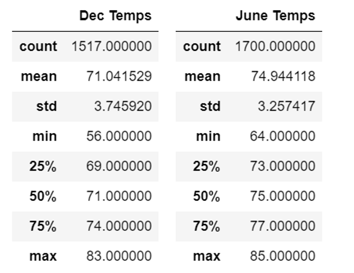

#Surf's Up Statistical Analysis
---
## Analysis Overview
- The purpose of this analysis was to identify any significant weather trends in Oahu in the months of June and December that would identify any underlying implications as to whether or not Oahu is the optimal place for W. Avy to invest in a surf shop there.
---
## Results
1. As displayed below, the summary statistics for the month of December show the mean temperature to be ~71 degrees. Meanwhile, the mean temperature for the month of June is ~75. 

---
2. Further, the minimum temperature from the month of June is 64 degrees, while the minimum temperature for the month of December is 56 degrees. 
---
3. Lastly, the maximum temperature for the month of June is 85 degrees and the maximum temperature for the month of December is 83 degrees. Therefore, even in the Winter month of December, it is still possible for temperatures in Oahu to reach almost that of the maximum temperature found from the June data. 
---
---
## Summary 
- From a high-level, these results indicate that Oahu is an attractive destination to start a surf shop because the weather does not seem to be very volatile as seen from the quartiles, maxs., mins., and means shown in the summary statistics above.
### Additional Query #1
- The first additional query I would perform to acquire more meaningful data on Oahu's historical temperatures from the months of June and December is perform the same analysis on the precipitation column since temperature does not indicate precipitation and high levels of precipitation are not desirable surfing conditions. 
### Additional Query #2
- The second query I would execute is the to observe the std deviation among other summary statistics on other undesirable/desirable weather conditions like wind, cloudiness, humidity, etc.
